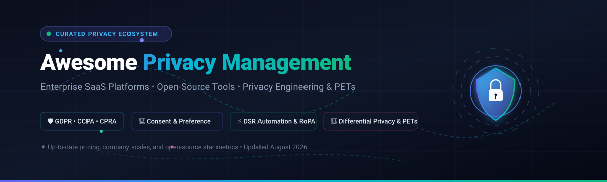

<p align="center">
  
</p>

# 🛡️ Awesome-Privacy-Management

<p align="center">
  <a href="https://github.com/ishandutta2007/Awesome-Awesome-Awesome"></a>
  <a href="https://discord.gg/jc4xtF58Ve"></a>
  <a href="https://github.com/ishandutta2007/Awesome-Privacy-Management/stargazers"></a>
  <a href="https://github.com/ishandutta2007/Awesome-Privacy-Management/network/members"></a>
  <a href="https://github.com/ishandutta2007/Awesome-Privacy-Management/blob/main/LICENSE"></a>
  <a href="https://github.com/ishandutta2007/Awesome-Privacy-Management/pulls"></a>
  <a href="https://github.com/ishandutta2007"></a>
</p>

---

## 🌟 Top Privacy Management Ecosystem

**A Curated List of Enterprise SaaS Platforms & Open-Source GitHub Projects for Modern Data Privacy Engineering & Governance.**

*Focused on Privacy Management, Consent & Preference Management (CMP), Data Subject Access Requests (DSAR / DSR), Data Mapping & RoPA, Privacy Impact Assessments (DPIA), Privacy-Enhancing Technologies (PETs), Differential Privacy, De-identification, Vendor Risk, and Regulatory Compliance (GDPR, CCPA/CPRA, LGPD, HIPAA, ePrivacy).*

📅 **Last updated: August 2026**

---

### 📖 Overview

Modern privacy management has evolved from static legal checklists to continuous, programmable data governance and privacy engineering. Organizations must dynamically track personal data across cloud infrastructures, automate user rights fulfillment, capture granular consent across digital properties, enforce data-retention rules, and apply privacy-enhancing technologies (PETs) to AI/ML pipelines.

This repository tracks the leading **enterprise SaaS platforms** (ranked by company scale/valuation) and **open-source developer tooling** (ranked by GitHub stars) that make privacy compliance, data mapping, and privacy-preserving engineering possible.

---

## 📑 Table of Contents

- [☁️ SaaS / Hosted Platforms](#-saas--hosted-platforms)
- [💻 Open-Source GitHub Projects](#-open-source-github-projects)
- [🧩 Privacy Architecture & Composable Building Blocks](#-privacy-architecture--composable-building-blocks)
- [🤝 How to Contribute](#-how-to-contribute)
- [📈 Star History](#-star-history)
- [⚖️ Disclaimer](#️-disclaimer)

---

## ☁️ SaaS / Hosted Platforms

Below is a curated comparison of notable privacy management SaaS platforms, **sorted in descending order by company scale (Valuation / Estimated ARR)**. Each entry includes verified starting-tier pricing and precise free tier / trial limits.

| Platform | Scale (Valuation / ARR) | Core Focus & Capabilities | Starting Tier Pricing | Free Tier / Trial Limits |
| :--- | :--- | :--- | :--- | :--- |
| **[OneTrust](https://www.onetrust.com/)** | **~$4.5B–$5.3B Valuation**<br>_~$550M+ ARR_ | Comprehensive enterprise "Trust Intelligence" platform covering privacy automation, data mapping, consent & preferences, DSR automation, risk assessments, and AI governance. | Starts at **$10,000/year** (Enterprise packages; modular tools historically from $30–$50/mo per module) | **14-day free trial** upon sales request; free standalone assessment tools (no free forever platform plan) |
| **[Sovos](https://sovos.com/)** | **~$4.0B+ Valuation**<br>_~$450M+ ARR_ | Global regulatory compliance, statutory tax reporting, and enterprise data-governance platform supporting multi-jurisdictional obligations. | Starts at **$15,000/year** (~$1,250/month base suite) | **Free sandbox API test accounts** (e.g., TINCheck) & **30-day trial** for select modules (no free forever suite) |
| **[Securiti](https://securiti.ai/)** | **$1.725B Valuation**<br>_~$75M–$100M+ ARR_ | Unified Data Command Center for data privacy, security, and governance providing AI-driven sensitive data intelligence, classification, and DSR automation. *(Acquired by Veeam)* | Starts at **$50,000/year** (or ~$4,200/mo; regional starting tiers from ~₹15L/yr) | **Guided proof-of-concept trial** upon sales consultation (no free forever plan) |
| **[BigID](https://bigid.com/)** | **$1.0B+ Valuation**<br>_~$100M+ ARR_ | Enterprise data intelligence and privacy platform offering automated deep discovery, ML-based classification, sensitive-data mapping, and data lifecycle management. | Starts at **$25,000/year** (Base enterprise deployment) | **Guided evaluation trial** arranged via sales demo / AWS Marketplace (no free forever plan) |
| **[TrustArc](https://trustarc.com/)** | **~$300M–$400M Valuation**<br>_~$80M–$100M ARR_ | Enterprise privacy management platform covering privacy operations, data mapping, risk assessments, consent & preference management, and individual rights. | Starts at **$10,000/year** (Average contract ~$22,000/year) | **30-day free trial** for platform evaluation / Nymity Research access (no free forever plan) |
| **[Transcend](https://transcend.io/)** | **~$250M–$300M Valuation**<br>_~$16M–$25M ARR_ | Developer-friendly privacy automation platform focused on programmatic DSR fulfillment, consent & telemetry control, and automated data mapping across databases and APIs. | Starts at **$10,000/year** (~$833/month) | **14 to 30-day proof-of-concept trial** upon sales request (no free forever plan) |
| **[DataGrail](https://www.datagrail.io/)** | **~$250M–$300M Valuation**<br>_~$16M–$20M ARR_ | Automated privacy management platform with 2,000+ pre-built SaaS connectors for continuous data discovery, automated data mapping, DSR handling, and consent orchestration. | Starts at **$60,000/year** (Mid-market packages; implementation fees ~$15k–$35k) | **Product demo & custom POC trial** on request (no free forever plan) |
| **[Usercentrics](https://usercentrics.com/)** | **~$150M–$200M Valuation**<br>_~$40M–$50M ARR_ | Global Consent Management Platform (CMP) empowering organizations to collect, manage, and synchronize user consent across websites, mobile apps, and connected TV. | Starts at **$8/month** (~€7/mo for Essential plan) | **Free forever plan** (1 domain, up to 1,000 sessions/month); **14-day free trial** with full premium features (no credit card required) |
| **[Didomi](https://www.didomi.io/)** | **~$150M–$200M Valuation**<br>_~$15M–$25M ARR_ | Multi-regulation consent and preference management platform (CMP) supporting granular consent banners, omnichannel preference centers, and privacy compliance monitoring. | Starts at **$250/month** (~€250/mo for Essential CMP tier) | **14-day evaluation trial** upon demo request (no free forever plan) |
| **[Osano](https://www.osano.com/)** | **~$120M–$150M Valuation**<br>_~$10M–$15M ARR_ | Privacy operations platform providing "No-Lawsuit-Guaranteed" cookie consent, automated DSAR workflows, vendor risk monitoring, and RoPA mapping. | Starts at **$199/month** (Plus plan, billed annually) | **Free forever plan** (1 domain, 1 user, up to 5,000 monthly visitors); **30-day free trial** for full platform |
| **[MineOS](https://mineos.ai/)** | **~$120M–$150M Valuation**<br>_~$10M–$15M ARR_ | Modern data privacy operations platform providing automated data mapping, shadow IT discovery, and automated Data Subject Request fulfillment. | Starts at **$10,000/year** (~$833/month) | **14-day free trial** for automated request handling and data discovery (no free forever commercial plan) |
| **[Ketch](https://www.ketch.com/)** | **~$120M–$150M Valuation**<br>_~$10M–$20M ARR_ | Programmable privacy infrastructure platform for managing programmatic consent, data rights, and automated policy enforcement via API/SDK. | Starts at **$150/month** (Starter plan) | **Free forever plan** (up to 5,000 monthly unique users, 2 integrations, CMP & preference center); **30-day free trial** for paid tiers |
| **[iubenda](https://www.iubenda.com/)** | **~$80M–$100M Valuation**<br>_~$15M–$20M ARR_ | All-in-one compliance suite for businesses offering automated privacy/cookie policies, cookie banners with Google Consent Mode v2, and Terms of Service generation. *(Part of team.blue)* | Starts at **$5.99/month** (Essentials plan) | **Free forever plan** (1 domain, up to 1,000 pageviews/month, 1 language, 3 legal clauses); **14-day free trial** for paid plans |
| **[Privado](https://www.privado.ai/)** | **~$60M–$100M Valuation**<br>_~$5M–$10M ARR_ | Static code analysis engine for privacy engineering that discovers personal data flows, data leaks, and third-party tracking libraries directly inside source code. | Starts at **$250/month** (Web Auditor, billed annually) / $4,200/mo for Developer Platform | **Free forever open-source CLI** on GitHub; 1 free website audit report; custom evaluation trial |
| **[WireWheel](https://wirewheel.io/)** | **Acquired by Osano**<br>_~$50M historical valuation_ | Privacy management suite supporting automated data inventories, RoPA records, privacy assessments (DPIA/PIA), and individual rights portals. | Starts at **$199/month** (via Osano platform integration) | **30-day free trial** via Osano platform (no free forever plan) |
| **[Termly](https://termly.io/)** | **~$30M–$50M Valuation**<br>_~$10M–$15M ARR_ | Self-serve privacy compliance solution for SMBs offering cookie consent banners, DSAR intake forms, and automated legal policy generators. | Starts at **$10/month** (billed annually) / $14/month (Starter plan) | **Free forever plan** (1 website, 1 basic policy, up to 10,000 banner views/month, quarterly scans); 30-day money-back guarantee |
| **[CookieYes](https://www.cookieyes.com/)** | **~$30M–$50M Valuation**<br>_~$8M–$12M ARR_ | Leading cloud-based cookie consent management solution powering over 1.4 million websites with customizable banners and automated cookie scanning. | Starts at **$10/month per domain** (Basic plan) | **Free forever plan** (1 domain, up to 5,000 pageviews/month); **14-day free trial** on all paid plans |
| **[Cookiebot](https://www.cookiebot.com/)** | **Part of Usercentrics**<br>_~$20M standalone ARR_ | Automated website cookie scanner and consent banner solution specializing in automated script blocking, IAB TCF 2.2, and Google Consent Mode v2. | Starts at **$8/month** (~€7/mo for Lite/Small tier) | **Free forever plan** (1 domain, up to 50 subpages); **14-day free trial** of Premium features (no credit card required) |
| **[Data Privacy Manager](https://dataprivacymanager.net/)** | **~$20M–$30M Valuation**<br>_~$5M–$8M ARR_ | Modular privacy management software (by Legit) covering RoPA maintenance, Privacy Impact Assessments, consent records, and automated DSR processing. | Starts at **$5,000/year** (~€400/month starter module) | **14-day guided proof-of-concept trial** upon demo request (no free forever plan) |
| **[Complianz](https://complianz.io/)** | **~$15M–$25M Valuation**<br>_~$3M–$6M ARR_ | Privacy suite and consent management plugin for WordPress and Shopify featuring automated cookie scanning, conditional script blocking, and legal document generation. | Starts at **$59/year** (~$4.92/month for 1 WordPress site) / $2.99/month on Shopify | **Free forever plugin** (unlimited pageviews & consent logs, scans up to 50 pages); 30-day refund policy on premium licenses |
| **[Clym](https://www.clym.io/)** | **~$5M–$10M Valuation**<br>_~$1M–$3M ARR_ | Unified compliance platform combining cookie consent banners, web accessibility widgets (WCAG/ADA), and data subject request management into a single embed. | Starts at **$49/month** (Start plan) | **14-day free trial** with full platform access (up to 50,000 pageviews during trial, no credit card required) |
| **[Enzuzo](https://www.enzuzo.com/)** | **~$5M–$10M Valuation**<br>_~$1M–$2M ARR_ | Modern privacy and consent platform built for eCommerce and SMBs, featuring multilingual cookie banners, privacy policy generators, and automated DSAR workflows. | Starts at **$9/month** ($7/month billed annually for Starter plan) | **Free forever plan** (1 domain, up to 5,000 monthly visitors, 3 DSARs/month, Google Consent Mode v2 support) |

---

## 💻 Open-Source GitHub Projects

A comprehensive collection of open-source privacy management platforms, privacy-preserving infrastructure, differential privacy engines, data catalogs, PII de-identification tools, and consent libraries.

**Sorted in descending order by GitHub Stars ⭐ (highest to lowest)**.

| Rank | Project / Repository | Github_Stars | Category / Description |
| :---: | :--- | :---: | :--- |
| 1 | **[Nextcloud](https://github.com/nextcloud/server)** | [](https://github.com/nextcloud/server/stargazers) | 🏢 **Data Sovereignty & Self-Hosted Infrastructure**<br>Self-hosted productivity platform providing full data sovereignty, end-to-end encryption, and compliance controls. |
| 2 | **[Keycloak](https://github.com/keycloak/keycloak)** | [](https://github.com/keycloak/keycloak/stargazers) | 🔑 **Identity & Access Management**<br>Open-source IAM platform providing authentication, authorization, single sign-on (SSO), and consent-driven user flows. |
| 3 | **[Vault](https://github.com/hashicorp/vault)** | [](https://github.com/hashicorp/vault/stargazers) | 🔒 **Secrets & Encryption Management**<br>Tool for secrets management, encryption as a service, and fine-grained data protection for privacy backends. |
| 4 | **[Authentik](https://github.com/goauthentik/authentik)** | [](https://github.com/goauthentik/authentik/stargazers) | 🛡️ **Identity Provider & Privacy Portals**<br>Open-source Identity Provider focused on flexibility and privacy, ideal for securing self-hosted DSAR and privacy portals. |
| 5 | **[Wazuh](https://github.com/wazuh/wazuh)** | [](https://github.com/wazuh/wazuh/stargazers) | 🕵️ **Security & Compliance Auditing**<br>Open-source unified XDR and SIEM platform used for regulatory compliance monitoring (GDPR/HIPAA), file integrity, and incident detection. |
| 6 | **[OpenMetadata](https://github.com/open-metadata/OpenMetadata)** | [](https://github.com/open-metadata/OpenMetadata/stargazers) | 📊 **Data Catalog & PII Classification**<br>Open context platform for data discovery, data lineage, automated PII tagging, and data governance mapping. |
| 7 | **[Zitadel](https://github.com/zitadel/zitadel)** | [](https://github.com/zitadel/zitadel/stargazers) | 🆔 **Identity Infrastructure & Governance**<br>Cloud-native identity and access management system with built-in audit trails and multi-tenancy for privacy architectures. |
| 8 | **[Trino](https://github.com/trinodb/trino)** | [](https://github.com/trinodb/trino/stargazers) | ⚡ **Distributed Federated Query Engine**<br>Fast distributed SQL query engine allowing centralized privacy scans and DSR queries across heterogeneous databases without moving data. |
| 9 | **[DataHub](https://github.com/datahub-project/datahub)** | [](https://github.com/datahub-project/datahub/stargazers) | 🧭 **Metadata & Data Lineage**<br>Extensible metadata platform for data discovery, lineage mapping, dataset ownership, and personal-data tracking across systems. |
| 10 | **[Open Policy Agent (OPA)](https://github.com/open-policy-agent/opa)** | [](https://github.com/open-policy-agent/opa/stargazers) | 📜 **Policy as Code & Authorization**<br>General-purpose policy engine for enforcing fine-grained privacy rules, data access boundaries, and purpose-of-use constraints. |
| 11 | **[Microsoft Presidio](https://github.com/microsoft/presidio)** | [](https://github.com/microsoft/presidio/stargazers) | 🔍 **PII Detection & Anonymization SDK**<br>Context-aware SDK for detecting, redacting, masking, and anonymizing sensitive PII across text, images, and structured datasets. |
| 12 | **[PySyft](https://github.com/OpenMined/PySyft)** | [](https://github.com/OpenMined/PySyft/stargazers) | 🧠 **Privacy-Preserving AI & Data Science**<br>OpenMined framework enabling secure computation, differential privacy, and federated learning on data that remains on the owner's server. |
| 13 | **[Amundsen](https://github.com/amundsen-io/amundsen)** | [](https://github.com/amundsen-io/amundsen/stargazers) | 🔎 **Data Discovery & Asset Inventory**<br>Metadata-driven platform for indexing enterprise data assets, tracking sensitive columns, and building personal-data inventories. |
| 14 | **[OpenLineage](https://github.com/OpenLineage/OpenLineage)** | [](https://github.com/OpenLineage/OpenLineage/stargazers) | ⛓️ **Data Lineage Standard**<br>Open standard and ecosystem for tracking data flows and transformations across pipelines to construct complete RoPA data maps. |
| 15 | **[Apache Atlas](https://github.com/apache/atlas)** | [](https://github.com/apache/atlas/stargazers) | 🏛️ **Data Governance & Classification**<br>Scalable governance platform providing classification, metadata tagging, and lineage tracking for enterprise data compliance. |
| 16 | **[PrivacyIDEA](https://github.com/privacyidea/privacyidea)** | [](https://github.com/privacyidea/privacyidea/stargazers) | 🔐 **Multi-Factor Authentication**<br>Modular two-factor authentication and identity system ensuring secure access to privacy infrastructure and administrative tools. |
| 17 | **[Klaro!](https://github.com/kiprotect/klaro)** | [](https://github.com/kiprotect/klaro/stargazers) | 🍪 **Website Consent Management Platform**<br>Privacy-friendly, GDPR/ePrivacy compliant open-source CMP supporting granular consent, multilingual banners, and script management. |
| 18 | **[Apache Ranger](https://github.com/apache/ranger)** | [](https://github.com/apache/ranger/stargazers) | 🛡️ **Centralized Data Security & Masking**<br>Framework to enable, monitor, and manage comprehensive data security, column masking, and row-level filtering policies. |
| 19 | **[ARX Data Anonymizer](https://github.com/arx-deidentifier/arx)** | [](https://github.com/arx-deidentifier/arx/stargazers) | 🧪 **Data Anonymization & De-identification**<br>Comprehensive data de-identification tool supporting k-anonymity, l-diversity, t-closeness, and differential privacy risk analysis. |
| 20 | **[Gretel Synthetics](https://github.com/gretelai/gretel-synthetics)** | [](https://github.com/gretelai/gretel-synthetics/stargazers) | 🤖 **Differentially Private Synthetic Data**<br>Synthetic data generation library featuring differentially private learning for creating privacy-preserving training datasets. |
| 21 | **[Diffprivlib (IBM)](https://github.com/IBM/differential-privacy-library)** | [](https://github.com/IBM/differential-privacy-library/stargazers) | 🔬 **Differential Privacy ML Library**<br>IBM open-source Python library implementing differential privacy algorithms with Scikit-learn compatibility for privacy-safe machine learning. |
| 22 | **[Fides](https://github.com/ethyca/fides)** | [](https://github.com/ethyca/fides/stargazers) | 🛠️ **Privacy Engineering & Privacy-as-Code**<br>Open-source privacy framework by Ethyca for automating Data Subject Requests (DSR/DSAR), privacy taxonomy, and consent orchestration. |
| 23 | **[OpenDP](https://github.com/opendp/opendp)** | [](https://github.com/opendp/opendp/stargazers) | 🧮 **Differential Privacy Core Engine**<br>Community-driven differential privacy algorithms library created by Harvard & Microsoft for privacy-preserving statistical computations. |
| 24 | **[Privado CLI](https://github.com/Privado-Inc/privado-cli)** | [](https://github.com/Privado-Inc/privado-cli/stargazers) | 🔎 **Privacy Code Scanner**<br>Static code analysis tool that maps personal data flows and detects privacy vulnerabilities and tracking violations directly in code. |
| 25 | **[Pryv](https://github.com/pryv/open-pryv.io)** | [](https://github.com/pryv/open-pryv.io/stargazers) | 📦 **Personal Data Sovereignty Engine**<br>Self-hosted personal data and consent management middleware with strict access scoping and audit trails. |
| 26 | **[ConsentStack](https://github.com/ConsentStack/cmp)** | [](https://github.com/ConsentStack/cmp/stargazers) | 📋 **Human-Centric CMP**<br>Developer-focused and user-respecting consent management platform for website cookies and user tracking choices. |
| 27 | **[Tumult Analytics](https://github.com/opendp/tumult-analytics)** | [](https://github.com/opendp/tumult-analytics/stargazers) | 📈 **Differential Privacy for SQL & DataFrames**<br>Python library for computing aggregate queries over tabular datasets while guaranteeing differential privacy. |
| 28 | **[Profile & Consent Manager (PCM)](https://github.com/Sympol/pcm)** | [](https://github.com/Sympol/pcm/stargazers) | 🗃️ **Immutable Consent Ledger**<br>Privacy-by-design identity and consent platform featuring an immutable consent ledger and modular domain architecture. |
| 29 | **[Microsoft Consent Package](https://github.com/microsoft/Consent-Package)** | [](https://github.com/microsoft/Consent-Package/stargazers) | 💻 **Developer Consent Management Sample**<br>Developer-oriented consent platform sample featuring granular consent, proxy consent, audit trails, and React UI components. |

---

## 🧩 Privacy Architecture & Composable Building Blocks

Unlike monolithic enterprise suites, open-source privacy management is best constructed using **composable specialized building blocks**:

```
┌─────────────────┐     ┌──────────────────────┐     ┌──────────────────────┐
│  Data Discovery │ ──► │ Metadata & Lineage   │ ──► │  Policy Enforcement  │
│  (Trino/Presidio│     │ (DataHub / OpenMeta) │     │  (OPA / Ranger)      │
└─────────────────┘     └──────────────────────┘     └──────────────────────┘
         │                         │                            │
         ▼                         ▼                            ▼
┌─────────────────┐     ┌──────────────────────┐     ┌──────────────────────┐
│ Privacy in Code │     │ Consent Orchestration│     │ Differential Privacy │
│ (Privado/Fides) │     │ (Klaro / Fides CMP)  │     │ (OpenDP / Diffpriv)  │
└─────────────────┘     └──────────────────────┘     └──────────────────────┘
```

### 🛠️ Recommended Component Combinations

- **Consent Management & Cookie Preference**: Combine **[Klaro!](https://github.com/kiprotect/klaro)** or **[ConsentStack](https://github.com/ConsentStack/cmp)** with **[Microsoft Consent Package](https://github.com/microsoft/Consent-Package)**.
- **Privacy Engineering & DSR Automation**: Pair **[Fides](https://github.com/ethyca/fides)** (DSR workflows) with **[Privado CLI](https://github.com/Privado-Inc/privado-cli)** (code scans) and **[Microsoft Presidio](https://github.com/microsoft/presidio)** (PII masking).
- **Data Inventory, Discovery & Lineage (RoPA)**: Combine **[OpenMetadata](https://github.com/open-metadata/OpenMetadata)** or **[DataHub](https://github.com/datahub-project/datahub)** with **[OpenLineage](https://github.com/OpenLineage/OpenLineage)** and **[Trino](https://github.com/trinodb/trino)**.
- **Data Access Policy & Secrets**: Enforce authorization with **[Open Policy Agent (OPA)](https://github.com/open-policy-agent/opa)**, **[Apache Ranger](https://github.com/apache/ranger)**, and manage keys with **[Vault](https://github.com/hashicorp/vault)**.
- **Identity & Privacy Portals**: Secure user verification with **[Keycloak](https://github.com/keycloak/keycloak)**, **[Authentik](https://github.com/goauthentik/authentik)**, or **[Zitadel](https://github.com/zitadel/zitadel)**.
- **Differential Privacy & Anonymization**: Use **[OpenDP](https://github.com/opendp/opendp)**, **[Diffprivlib](https://github.com/IBM/differential-privacy-library)**, **[ARX](https://github.com/arx-deidentifier/arx)**, and **[Gretel Synthetics](https://github.com/gretelai/gretel-synthetics)** for privacy-preserving data science.

---

## 🤝 How to Contribute

We welcome contributions to keep this ecosystem accurate and comprehensive!

1. 🍴 Fork the repository.
2. 📝 Add or update entries in [README.md](README.md):
   - For **SaaS platforms**, ensure starting-tier price, scale/valuation, and exact free tier/trial limits are documented in tabular format.
   - For **Open-Source projects**, add a social star badge `[](https://github.com/<owner>/<repo>/stargazers)` and place in the correct star-ranked position.
3. 🔎 Keep descriptions factual, objective, and link to official documentation.
4. 🚀 Submit a Pull Request with a clear summary of changes.

⭐ **Star the repository** if you find it helpful for your privacy compliance and engineering journey!

---

## 📈 Star History

[](https://star-history.dera.page/#ishandutta2007/Awesome-Privacy-Management&type=date&legend=top-left)

---

## ⚖️ Disclaimer

- This repository is a **community-curated index** for informational and educational purposes — not legal advice or direct commercial endorsement.
- Privacy regulations (GDPR, CCPA/CPRA, LGPD, HIPAA, etc.) vary significantly across jurisdictions and jurisdictions continue to evolve. Organizations should seek qualified legal counsel and certified Data Protection Officers (DPOs).
- Open-source privacy tools provide technical mechanisms (e.g., differential privacy, anonymization, access logs) but do not alone constitute automatic legal compliance.
- Always review licensing, maintenance activity, security audits, and production suitability before deploying software.

---

<p align="center">
  <b>Built with ❤️ for Privacy Officers, DPOs, Privacy Engineers, Compliance Managers, and Developers building privacy-first software.</b><br>
  <i>Let's make data privacy open, verifiable, composable, and developer-friendly.</i>
</p>
